# Damascus — Technical Spec

## 1. Background

**Problem Statement:**
Small group conversations at conferences, workshops, and meetings produce valuable ideas that are lost because no one takes adequate notes. Existing transcription tools (Otter.ai, Whisper cloud APIs, Google Recorder) require internet connectivity, send audio to third-party servers, and fail in privacy-sensitive contexts. There is no open source, offline-first, multi-speaker transcription tool designed for small group collaboration (3–8 people).

**Context / History:**
- Whisper (OpenAI) proved local speech-to-text is viable on consumer hardware
- Growing demand for privacy-respecting tools in activist, journalist, and research communities
- Conference season (summer 2026) is the target launch window
- Model ecosystem is evolving rapidly — new local STT models ship roughly every 2 months

**Stakeholders:**
- End users: Conference attendees, workshop facilitators, research groups, journalists
- Contributors: Open source community
- Downstream integrations: FileVerse, CryptPad, Signal (via share/export)

---

## 2. Motivation

**Goals & Success Stories:**

1. **Capture group conversations locally.** A workshop facilitator hits record, and 5 participants' speech is transcribed in real time on the facilitator's device — no cloud, no accounts, no internet required.

2. **Attribute speech to speakers.** Each participant's contributions are labeled by speaker identity. Enrolled speakers are identified by name via voice fingerprinting; unenrolled speakers are distinguished via unsupervised clustering and labeled as "Speaker 1", "Speaker 2", etc.

3. **Summarize and share privately.** After the session, the facilitator generates a summary and shares it to participants via FileVerse or CryptPad — encrypted before it ever touches a network.

4. **Swap models without friction.** When a better STT model drops, the user downloads it and swaps it in through settings. No rebuilds, no code changes.

5. **Prevent accidental leakage.** A non-technical user cannot accidentally upload raw audio or unencrypted transcripts to a cloud service. The tool is "idiot-proof" by default.

---

## 3. Scope and Approaches

### Non-Goals

| Technical Functionality | Reasoning |
|---|---|
| Cloud/remote transcription | Core constraint — local-only, no remote calls |
| MCP integration | Explicitly out of scope per requirements |
| Real-time translation | Adds complexity; defer to post-v1 |
| Video recording | Audio-only for v1; photo attachment for whiteboards is a future consideration |
| Nation-state threat model | V1 targets accidental leakage prevention, not adversarial nation-state attacks |
| iOS/desktop support | Platform decision deferred; v1 targets a single platform |
| Bluetooth/proximity sharing | Future consideration, not v1 |

### Tradeoffs

| Area | Tradeoff | Risk |
|---|---|---|
| Local-only processing | Higher privacy, no cloud dependency | Slower transcription on low-end devices; model size limited by device storage |
| Swappable models | Keeps tool current as ecosystem evolves | Users must manually download models; no auto-update mechanism |
| Voice fingerprinting | Enables speaker attribution | Accuracy degrades with >8 speakers or similar voices |
| Post-recording summarization | 2+ minute delay acceptable | Users may expect real-time summaries; need clear UX indication of processing |
| FileVerse/CryptPad sharing | Privacy-preserving distribution | Adds SDK dependencies; FileVerse SDK maturity is unknown |
| No accounts/auth | Zero friction onboarding | No cross-device sync, no recovery if device is lost |

### Value Proposition

| Technical Functionality | Value | Tradeoffs |
|---|---|---|
| Local STT with live display | Users see transcription as it happens; builds trust in the tool | Requires capable device hardware (RAM, CPU/GPU) |
| Speaker diarization | Transcripts are attributed and navigable; works with both enrolled and unenrolled speakers via unsupervised clustering | Unenrolled speakers get generic labels until profiles are created |
| Configurable models | Users pick accuracy/speed/size tradeoff; tool stays current | More complex settings UI; user bears model selection burden |
| Encrypted export | Data never leaves device unencrypted | Adds export latency; recipients need compatible tools |
| Markdown/JSON/PDF export | Flexible downstream use | PDF generation adds binary dependency |
| Post-session summarization | Distills long transcripts into actionable notes; saves users from re-reading entire sessions | Adds a second model to manage; 2+ minute processing delay on long recordings |

### Alternative Approaches

| Approach | Pros | Cons |
|---|---|---|
| Fork an existing recorder app and add STT | Faster time to v1; proven audio capture | Inherits architectural debt; may fight upstream design decisions |
| Build from scratch with modular architecture | Clean separation of concerns; purpose-built for swappable models | Longer initial development; more decisions to make |
| Desktop-first (Electron/Tauri) | Easier dev tooling; more compute available | Not pocketable for conferences; misses mobile-first use case |
| Use a single bundled model (no swapping) | Simpler UX; smaller download | Becomes stale; can't adapt to user needs |

**Recommendation:** Build from scratch with modular architecture. The swappable-model requirement and privacy constraints make this the cleanest path.

### Relevant Metrics

- Transcription word error rate (WER) vs. ground truth per model
- Speaker diarization accuracy (% correctly attributed segments)
- Time-to-first-word (latency from speech to display)
- Summary generation time (target: <2 min for 1-hour recording)
- Export encryption overhead (ms)
- Device compatibility matrix (min RAM, CPU for acceptable performance)

---

## 4. Step-by-Step Flow

### 4.1 Main ("Happy") Path — Live Transcription Session

**Pre-condition:** App installed. At least one STT model downloaded. Speaker profiles optionally enrolled (unenrolled speakers are handled via unsupervised clustering).

1. **User** opens Damascus and taps **Start Session**
2. **System** initializes microphone capture, loads selected STT model into memory, loads speaker fingerprint database
3. **User** speaks (or multiple participants speak)
4. **System** captures audio in chunks → runs local STT inference → performs speaker diarization → displays attributed text in real time
5. **User** sees live transcript with speaker labels updating on screen
6. **User** taps a segment and hits **Correct** to fix a misrecognition (inline edit)
7. **User** taps **Stop Session**
8. **System** finalizes transcript, persists to local encrypted storage

### 4.2 Summary & Export Path

**Pre-condition:** A completed session exists in local storage.

1. **User** opens a past session and taps **Generate Summary**
2. **System** loads summarization model, runs inference on full transcript with configured system prompt and summarization strength
3. **System** displays summary (processing indicator shown; up to 2+ minutes acceptable)
4. **User** selects **Export** → chooses format (Markdown / JSON / PDF)
5. **System** generates file in selected format, stores locally
6. **User** selects **Share** → chooses destination:
   - **FileVerse**: System encrypts locally via FileVerse SDK → uploads encrypted blob
   - **CryptPad**: System generates shareable encrypted link
   - **Copy to clipboard**: Plain text for paste into Signal or other messenger

### 4.3 Model Management Path

**Pre-condition:** App installed.

1. **User** opens **Settings → Models**
2. **System** displays installed models, available model slots (STT, summarization)
3. **User** taps **Add Model** → selects model file from device storage (or downloads from a listed source)
4. **System** validates model format, registers it in the model registry
5. **User** sets the new model as active for STT or summarization
6. **System** confirms swap; next session uses the new model

### 4.4 Speaker Enrollment Path

**Pre-condition:** App installed, microphone accessible.

1. **User** opens **Settings → Speaker Profiles**
2. **User** taps **Add Speaker**, enters a name/label
3. **System** prompts user to record a ~10-second voice sample
4. **User** records sample
5. **System** generates voice fingerprint, stores locally
6. **Post-condition:** Speaker is available for automatic attribution in future sessions

### 4.5 Alternate / Error Paths

| # | Condition | System Action | Suggested Handling |
|---|---|---|---|
| A1 | Microphone permission denied | Cannot start session | Prompt user to grant mic permission; block record button until granted |
| A2 | Insufficient storage for model download | Download fails | Show storage requirements and current free space; suggest removing unused models |
| A3 | STT model fails to load (corrupted file) | Model initialization error | Show error with model name; suggest re-downloading; fall back to previously active model |
| A4 | Device runs out of memory during transcription | Inference crashes or stalls | Suggest a smaller model; auto-save transcript up to crash point; offer to resume |
| A5 | No speaker profiles enrolled | Diarization uses unsupervised clustering | Label segments as "Speaker 1, 2, …" automatically; offer optional enrollment post-session |
| A6 | Export to FileVerse fails (SDK error) | Encrypted blob not uploaded | Show error; offer to save encrypted file locally for manual sharing |
| A7 | User attempts to share unencrypted transcript externally | Share intent intercepted | Warn user that data will leave the device unencrypted; require explicit confirmation |

---

## 5. UML Diagrams

### 5.1 System Architecture

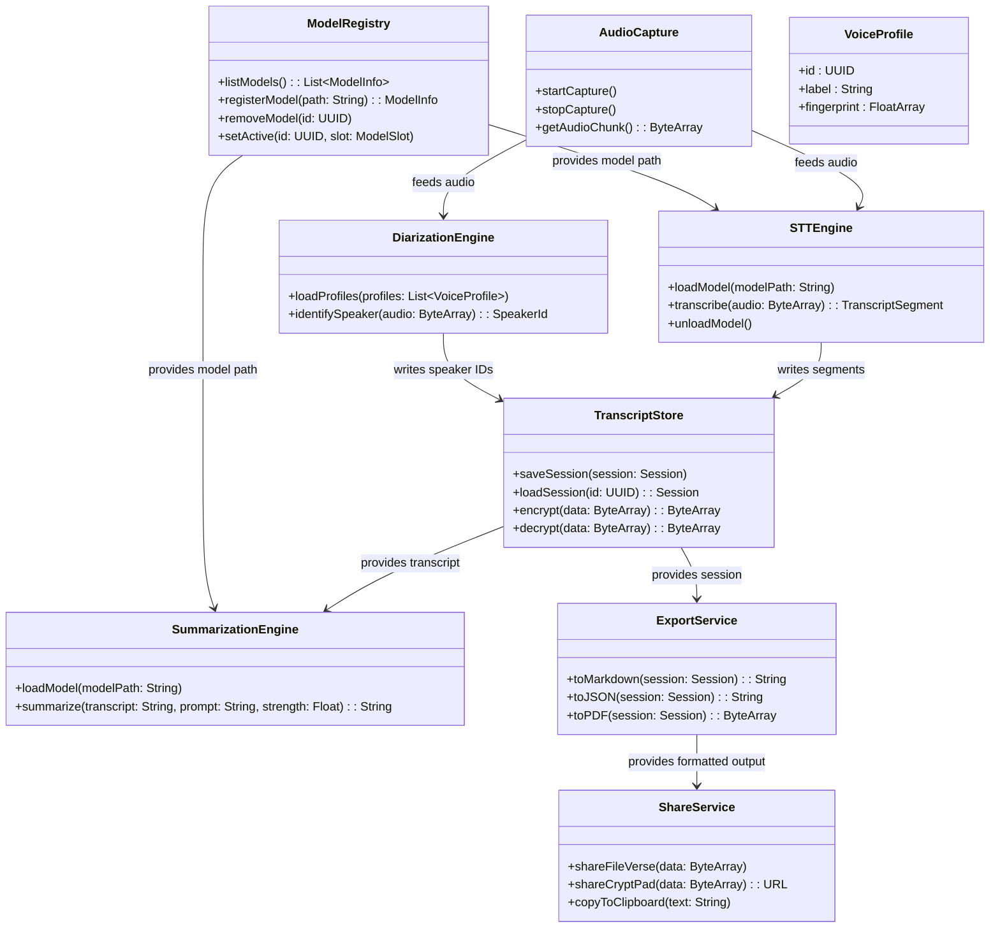

### 5.2 Live Transcription Sequence

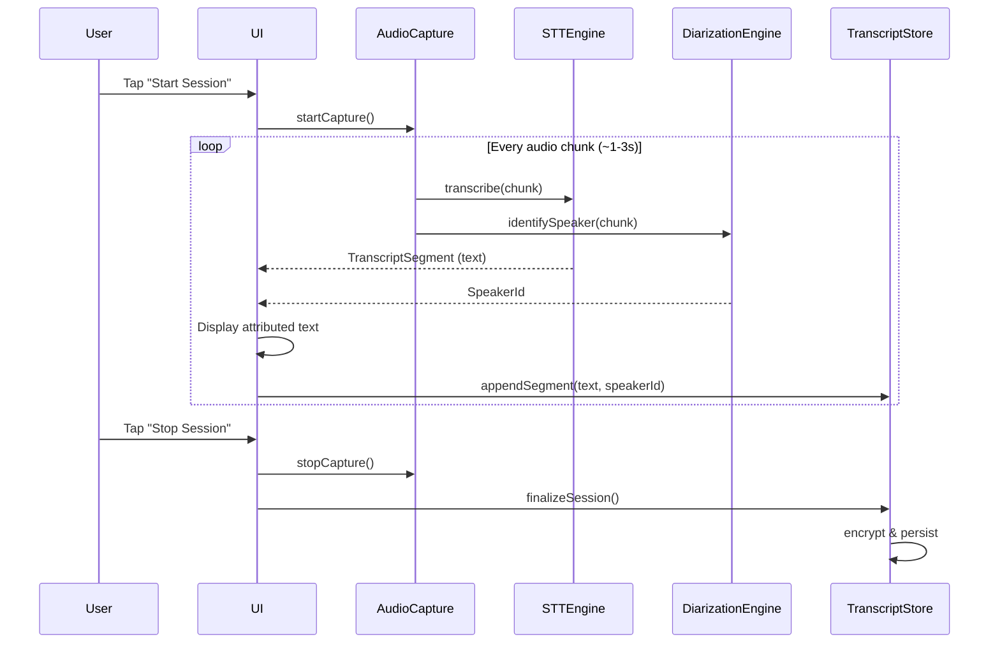

### 5.3 Summary & Export Sequence

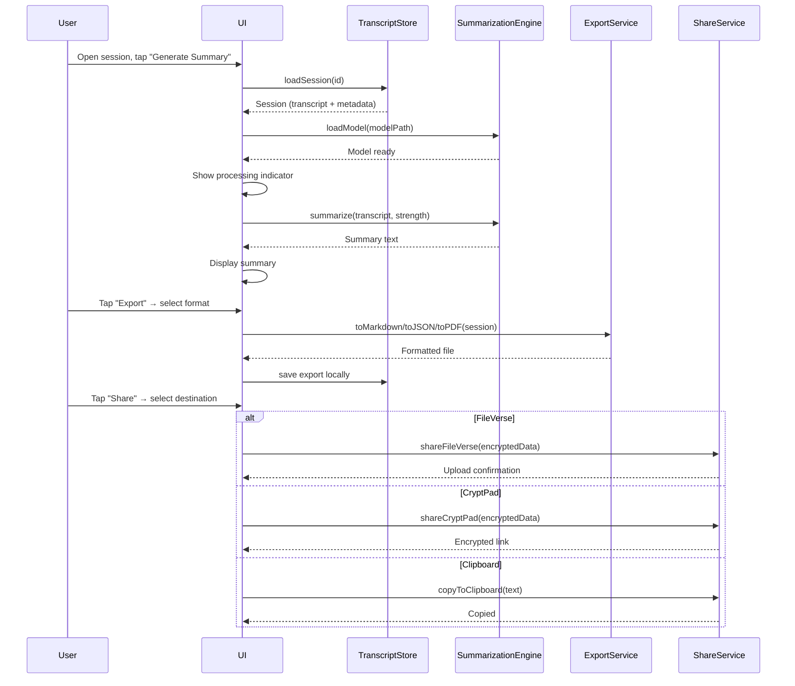

### 5.4 Model Management Sequence

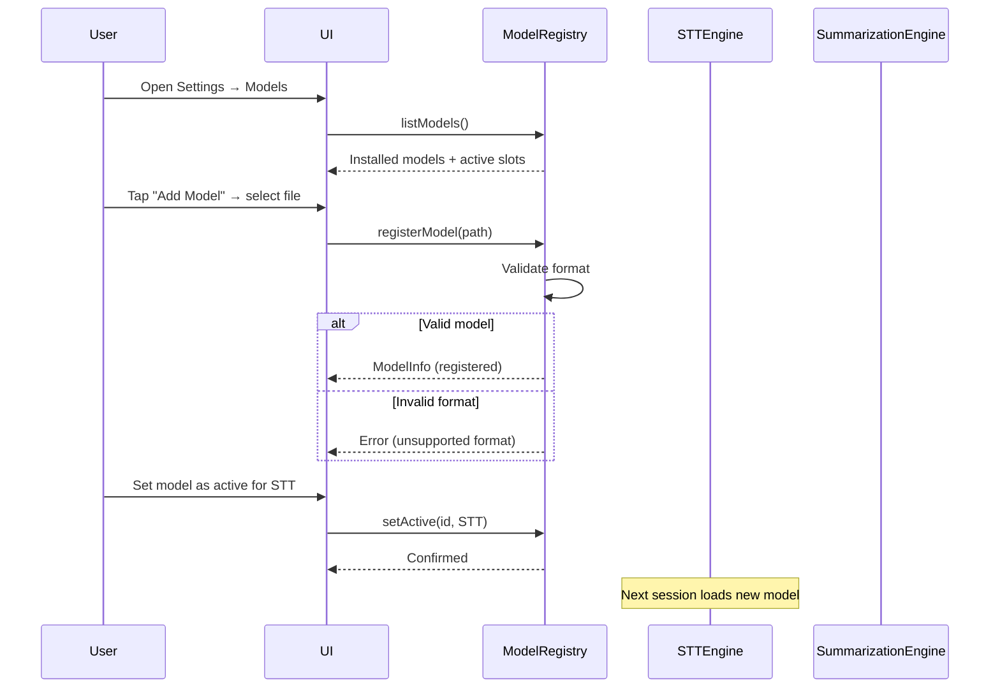

### 5.5 Speaker Enrollment Sequence

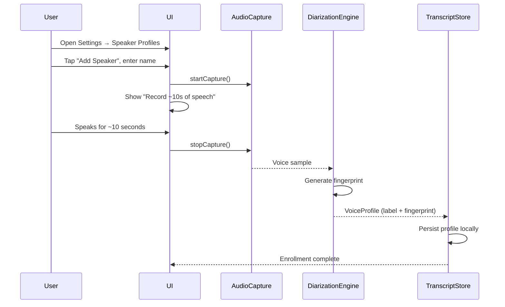

### 5.6 Session State Machine

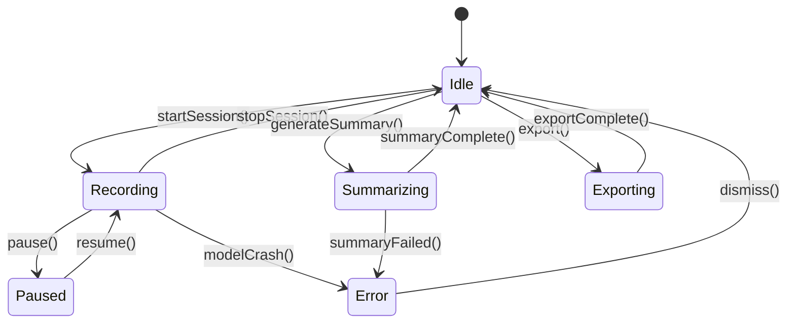

---

## 6. Edge Cases and Concessions

1. **Overlapping speech.** When multiple people talk simultaneously, STT accuracy drops significantly. V1 will transcribe the dominant voice in the chunk and may misattribute or drop quieter speakers. This is a known limitation of local diarization.

2. **Long sessions (>2 hours).** Memory pressure increases with session length. V1 will process in rolling windows and persist incrementally, but summary quality over very long transcripts may degrade.

3. **Model compatibility.** Not all ONNX/GGML models will work. V1 supports a curated list of model formats. Unsupported formats will fail at registration with a clear error.

4. **OS share intent leakage.** Platform share mechanisms can route data to any installed app, including cloud services. V1 mitigates this by:
   - Only offering Damascus-controlled share targets (FileVerse, CryptPad, clipboard)
   - Not using the system share sheet for transcript content
   - Encrypting before any network-touching operation

---

## 7. Open Questions

1. **FileVerse SDK:** Does the FileVerse SDK support fully on-device encryption before upload? What's the integration surface area? Need to prototype.

2. **Model distribution:** Resolved — V0 ships with one default model pre-installed. A curated model registry lives in the Damascus GitHub repo as a manifest file. Community members can submit new models via pull request; each entry includes compatibility info (format, min RAM, tested devices, WER benchmarks). The app reads this manifest to show available models in Settings.

3. **Minimum device specs:** What's the floor for acceptable performance? Need benchmarking on representative target hardware.

4. **Voice enrollment UX:** Is 10 seconds of speech enough for reliable fingerprinting? What's the minimum for acceptable diarization accuracy?

5. **CryptPad integration:** Does CryptPad expose an API or SDK for programmatic document creation, or does sharing mean generating a self-decrypting link?

6. **Summarization model selection:** Which local summarization models fit in mobile memory alongside the STT model? Can both run concurrently or must STT be unloaded first?

7. **Licensing:** What open source license for Damascus? GPLv3 (copyleft, ensures forks stay open) vs. Apache 2.0 (permissive, wider adoption)?

8. **Audio retention policy:** Should raw audio be stored alongside transcripts, or discarded after transcription? Storage vs. re-transcription tradeoff.

---

## 8. Glossary / References

| Term | Definition |
|---|---|
| **STT** | Speech-to-Text — converting audio input to written text |
| **Diarization** | The process of identifying "who spoke when" in an audio stream |
| **Voice fingerprint** | A numerical embedding representing a speaker's vocal characteristics |
| **WER** | Word Error Rate — standard metric for transcription accuracy |
| **GGML** | A tensor library format used by llama.cpp and whisper.cpp for running models on CPU |
| **ONNX** | Open Neural Network Exchange — a portable model format supported across runtimes |
| **FileVerse** | A decentralized file sharing platform with encryption capabilities |
| **CryptPad** | An open source, end-to-end encrypted collaboration suite |
| **System prompt** | A configuration string that shapes how a language model summarizes or processes text |

**Links:**
- [Whisper.cpp](https://github.com/ggerganov/whisper.cpp) — C/C++ port of OpenAI Whisper for local inference
- [FileVerse](https://fileverse.io/) — Decentralized file sharing
- [CryptPad](https://cryptpad.org/) — Encrypted collaboration
- [ONNX Runtime Mobile](https://onnxruntime.ai/docs/tutorials/mobile/) — On-device model inference
- [pyannote-audio](https://github.com/pyannote/pyannote-audio) — Speaker diarization toolkit

---

## Appendix A: Model Change — Screen Flow

### A.1 Browse & Download a New Model

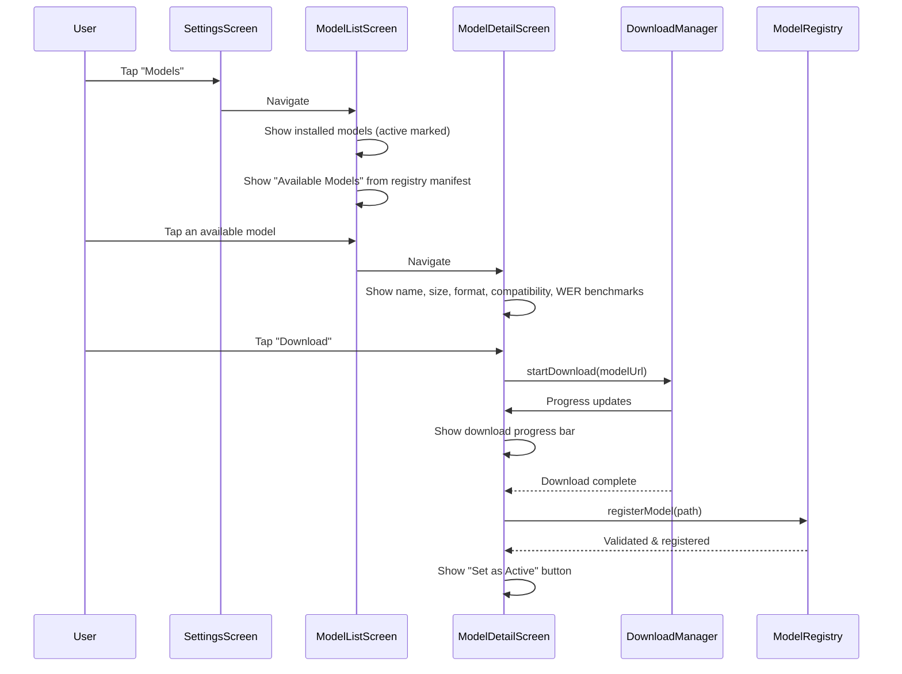

### A.2 Switch the Active Model

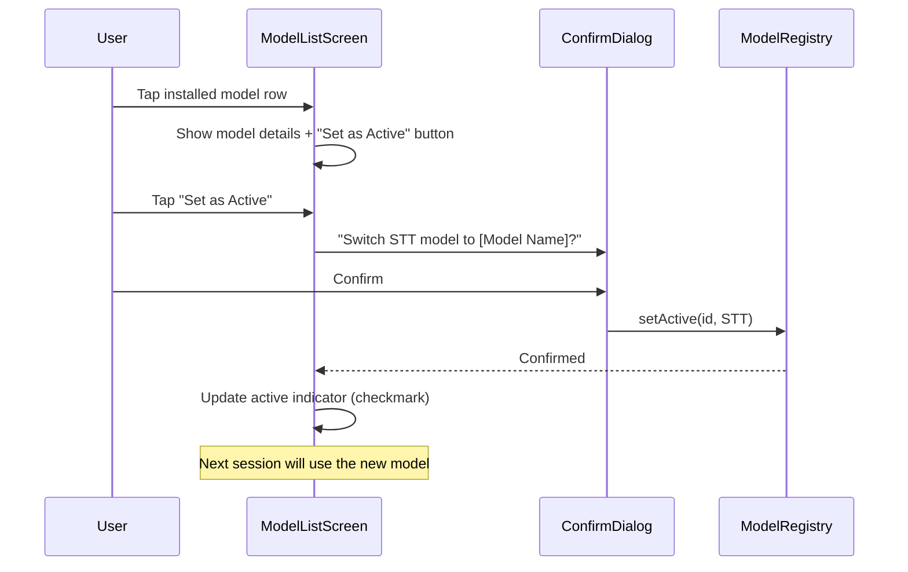

### A.3 Delete an Installed Model

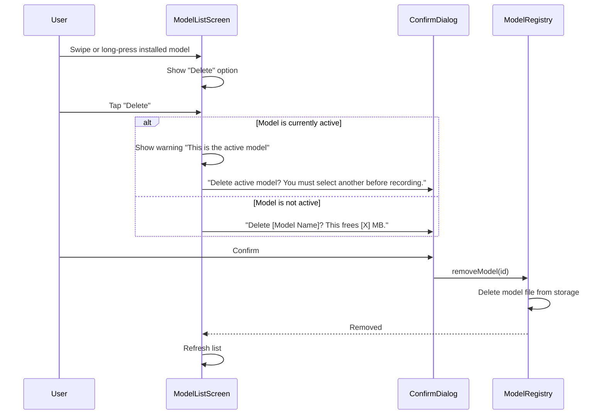
---

## Appendix B: Configuration — Screen Flow

Damascus exposes user-configurable settings through Settings. All config is stored locally on-device.

### B.0 Default Configuration

| Setting | Default | Options |
|---|---|---|
| Active STT model | (bundled default) | Any installed model |
| Active summarization model | (bundled default) | Any installed model |
| Summarization strength | Medium | Low / Medium / High |
| Audio retention | **Off** | Off / On |
| Export format | Markdown | Markdown / JSON / PDF |

### B.1 Toggle Audio Retention

Audio retention is **off by default** — raw audio is discarded after transcription completes. When enabled, audio is stored locally alongside the transcript in encrypted storage. This allows re-transcription with a different model later.

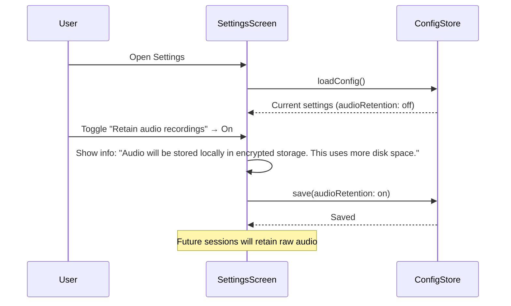

### B.2 Change Summarization Strength

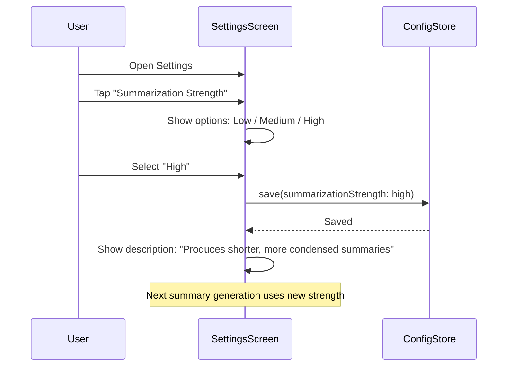

### B.3 Change Default Export Format

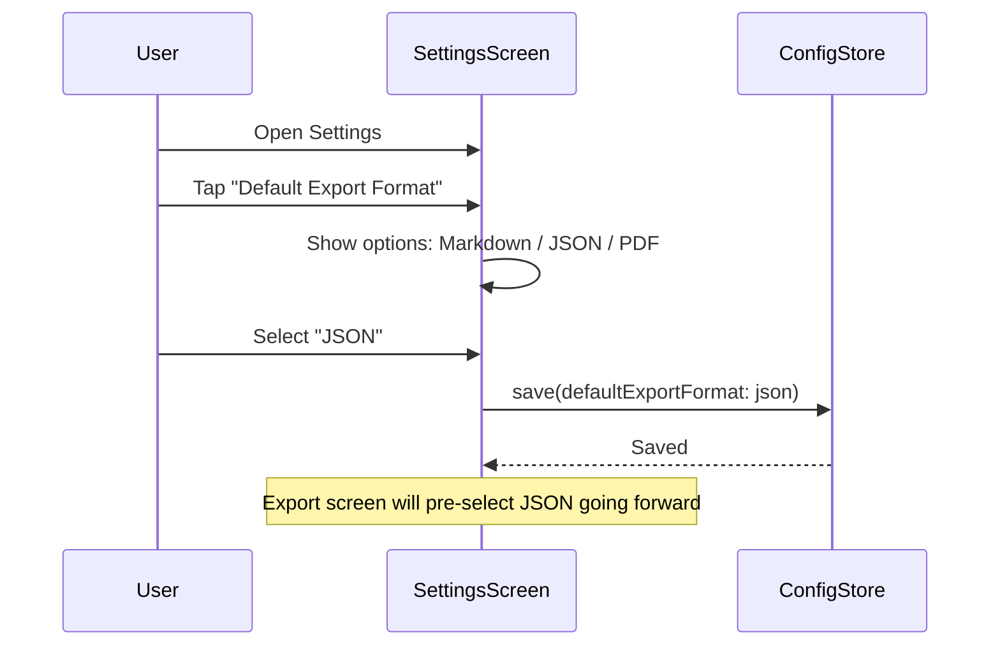

### B.4 Re-transcribe a Session (requires audio retention)

When audio retention is enabled, users can re-run transcription on a past session with a different model.

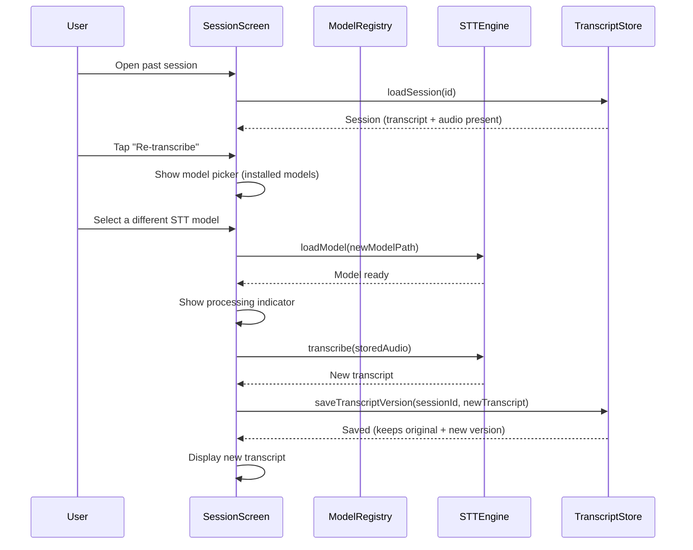
